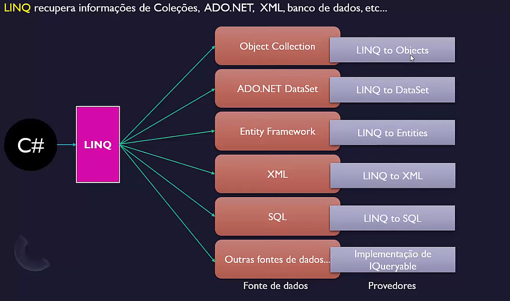
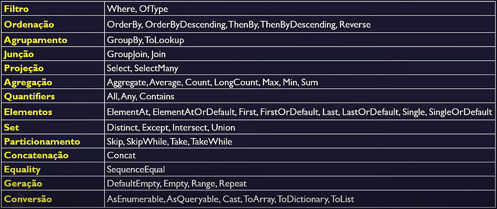

# LINQ

## Tabela de Conteúdo
- [Introdução](#introdução)
    - [Retornos](#retornos-da-linq)
    - [Vantages](#vantages-da-linq)
    - [Desvantagens](#desvantagens-da-linq)
- [Consulta](#consulta)
- [Sintaxe de Consultas](#sintaxe-de-consultas-linq)
    - [Query Syntax](#query-syntax)
    - [Method Syntax](#method-syntax)
    - [Tipos de Consulta](#tipos-de-consulta)
- [Operações](#operações)
    - [Filtrar Dados](#filtrar-dados)
    - [Projeção](#projeção)
    - [Conjunto](#conjunto)
    - [Ordenação](#ordenação)
    - [Agregação](#agregação)
    - [Quantificação](#quantificação)
    - [Agrupamento](#agrupamento)
    - [Junção](#junção)
    - [Elementos](#elementos)
    - [Particionamento](#particionamento)
    - [Geração](#geração)
    - [Conversão](#Conversão)
    - [Outras](#outras)
- [Créditos](#créditos)

---

## Introdução

`Language-Integrated Query(LINQ)` é um poderoso conjunto de tecnologias baseado na integração de recursos de consulta na linguagem C#.

A LINQ fornece uma experiência de consulta consistente para consultar objetos, bancos de dados relacionais, xml, entidades e outras fontes de dados. Além disso, possui uma sintaxe de consulta estruturada usando C#.




 ==As consultas LINQ retornam resultados como objetos.== Logo, permite usar uma abordagem orientada a objetos no conjunto de resultados sem se preocupar em transformar diferentes formatos de resultados em objetos.

## Retornos da LINQ

As consultas LINQ usam métodos de extensão para classes que implementam as [interfaces](conceitos/interface.md) **IEnumerable** ou **IQueryable**.

[Enumerable e Queryable](conceitos/ienumerable_e_iqueryable.md)  são duas classes estáticas que contêm métodos de extensão para escrever consultas LINQ.

Isso significa que podemos chamar os métodos LINQ em qualquer objeto que implemente **IEnumerable< T >** e **IQueryable < T >**. Podemos criar classes que implementam essas interfaces, que vão 'herdar' todas as funcionalidades da LINQ.

### IEnumerable< T >

É uma interface que garante que uma determinada classe seja *iterável*.
Uma classe que implementa IEnumerable< T > pode ser pensada e usada como uma sequência de elementos.

**Os métodos da link que retornam sequências são todas sequências do tipo `IEnumerable<T>`**. Para transformar estas sequências em listas ou arrays, a LINQ fornece dois métodos de conversão:

1. **ToList()** - converte um IEnumerable< T> para um List< T >
2. **ToArray()** - converte um IEnumerable< T > para um Array< T >

Nota: [diferenças de IEnumerable para List](conceitos/ienumerable_e_list)

## Vantages da LINQ

- Fornece uma sintaxe de consulta comum para consultar diferentes fontes de dados.
- Utiliza menos código em comparação com a abordagem tradicional de consulta.
- Fornece verificação de erros em tempo de compilação, bem como suporte de inteligência no Visual Studio, evitando erros em tempo de execução.
- Fornece muitos métodos embutidos que podemos usar para realizar diferentes operações, como filtragem, ordenação, agrupamento, etc.
- Permite a reutilização de consultas.

## Desvantagens da LINQ

- Consultas muito complexas são difícieis de escrever
- Não aproveita ao máximo os recursos da SQL, como o plano de execução em cache para o procedimento armazenado.
- Consultas mal escritas tendem a ter um desempenho pior.
- Alterações nas consultas exigem recompilar a aplicação e refazer o deploy.

---

## Consulta

==Todos os métodos genéricos LINQ podem **inferir implicitamente argumentos de tipo**, portanto não precisamos especificá-los  (na maioria dos casos usamos *var*).==

A maioria dos métodos LINQ aceita [delegates](conceitos/delegates.md) Func<> e Predicate<>. A opção mais comum para fornecer um delegate é escrever uma [**expressão lambda**](conceitos/lambda.md).

Ao trabalhar com a interface IQueryable< T >, a consulta é compilada (em SQL, por exemplo) e executada remotamente.

### Execução Imediata na LINQ

Os métodos LINQ que retornam IEnumerable< T > têm um conceito de **execução lenta** (também chamada de adiada ou lazy execution). Para forçar a consulta LINQ a ser executada e a retornar o resultado imediatamente, é necessário usar os operadores de conversão:

- ToList()
- ToArray()
- AsEnumerable
- AsQueryable
- ToDicitionary()
- ToLookup


## Sintaxe de consultas LINQ

Existem dois tipos, **Query Syntax** e **Method Syntax**.

### **Query Syntax** 
Também conhecida como Query Expression Syntax (Sintaxe de Consulta).

É um tipo de consulta usada em bancos de dados SQL.
```sql
FROM objeto in FonteDeDados
Where condicao
Select objeto
```

1. Inicialização: iniciamos com alguma fonte de dados para consultar usando a palavra-chave, ou cláusula, `FROM`.
2. Condição: Usamos operadores de consulta para adicionar **condições** para a consulta, começando com a palavra-chave `Where`.
3. Seleção: Agrupamos ou selecionamos os objetos que queremos, usando a palavra-chave `Select`, ou podemos usar `GroupBy`.

==*Obs*: No final podemos utilizar a palavra **var** para tratar o resultado, mas o tipo de objeto que a consulta gerará será do tipo *IEnumerable* ou *IQueryable*.==

Exemplo:
```cs
IList<string> frutas = new List<string>()
{
    "Banana", "Maça", "Uva", "Melão", "Laranja", "Pera"
};

var resultado = from f in frutas      // inicializando com a cláusula from
                where f.Contains('r') // usando operador para filtrar
                select f;            // terminando com cláusula select ou GroupBy

Console.WriteLine(string.Join(", ", resultado));
```

Saída no console:
```
Laranja, Pera
```


### **Method Syntax**

Também conhecida como Method Extension Syntax ou Fluent Syntax (Sintaxe de Método).

- Usa métodos de extensão incluídos nas classes estáticas **Enumerable** ou **Queryable**.
- ==Nem todos os métodos LINQ podem ser utilizados com sintaxe de consulta, um dos motivos da sintaxe de método levar vantagem. Além disso, a sintaxe de método é estilisticamente semelhante ao código C#.==
- A maior diferença na hora de se escrever uma consulta com a Sintaxe de Método, é que utilizamos um *Delegate Predicate* que receba o mesmo tipo de objeto que a consulta e retorne um **bool**. Geralmente esse delegate é feito com expressões **lambdas**, e serve para filtrar, agrupar, ordenar, ou fazer outras coisas com a fonte de dados que estamos trabalhando.

Exemplo:
```cs
IList<string> frutas = new List<string>()
{
    "Banana", "Maça", "Uva", "Melão", "Laranja", "Pera"
};

var resultado = frutas.Where(f => f.Contains('r'));
// o método Where seria o método de extensão
// enquanto a expressão lambda dentro deste método
// seria a condição da consulta

Console.WriteLine(string.Join(", ", resultado));
```
Saída no console:
```
Laranja, Pera
```

*==Obs*: O compilador converte a sintaxe de consulta em sintaxe de método em tempo de compilação.==

### `Tipos de consulta`



---

## Operações

### Filtrar Dados

Operadores de filtragem são usados para filtrar dados de uma **lista/coleção** com base nas condições do filtro. Usamos uma expressão booleana e somente os objetos que atenderem os requisitos dessa expressão são retornados.

- `Where` - usado para selecionar valores da coleção com base em *funções de predicado*
    ```
    fonteDados.Where(<expressão_lambda>);
    ```

Exemplo:
```cs
List<int> numeros = new List<int>();
numeros.Add(1);
numeros.Add(2);
numeros.Add(4);
numeros.Add(8);
numeros.Add(16);
numeros.Add(32);
numeros.Add(64);

List<int> numeros2 = new List<int>();
numeros2.Add(8);
numeros2.Add(16);
numeros2.Add(64);

// selecionando os números menores que 10
var resultado1 = numeros.Where(n => n < 10);

//  selecionando os números maiores que 1, menores que 20, e excluímos o 4
var resultado2 = numeros.Where(n => n > 1 && n != 4 && n < 20);

// selecionando todos os números da lista numeros menos os que também estão presentes na lista numeros2
var resultado3 = numeros.Where(n => !numeros2.Contains(n));

// mesmo resultado que o segundo exemplo, mas com o uso de 3 .Where seguidos
var resultado4 = numeros.Where(n => n > 1)
                        .Where(n=> n != 4)
                        .Where(n => n < 20);

Console.WriteLine(string.Join(" "), resultado1);
Console.WriteLine(string.Join(" "), resultado2);
Console.WriteLine(string.Join(" "), resultado3);
Console.WriteLine(string.Join(" "), resultado4);
```
Saída:
```
1 2 4 8
2 8 16
1 2 4 32
2 8 16
```

==Apesar de escrevermos as consultas de maneiras diferentes nos exemplos 2 e 4, não há diferença na velocidade e nem na performance dessas consultas. O compilador vai otimizar a consulta em ambos os casos.==

#### *Filtrando objetos complexos*

```cs
public class Aluno{
    public string Nome {get; set;}
    public int Idade {get; set;}
}

List<Aluno> alunos = new List<Aluno>();
alunos.Add("Maria", 18);
alunos.Add("João", 20);
alunos.Add("Pedro", 25);
alunos.Add("Marlene", 28);
alunos.Add("Fabio", 23);

// sintaxe de método
// selecionando os alunos que têm nomes começados em M e que têm menos de 20 anos de idade 
var resultado = alunos.Where(a => a.Nome.StartsWith('M') 
                            && a.Idade < 20);

foreach(var aluno in resultado)
    {
        Console.WriteLine(aluno.Nome + " - " + aluno.Idade);
    }

// sintaxe de consulta
// mesma consulta que a anterior
var resultado2 = from aluno in alunos 
                where aluno.Nome.StartsWith('M') 
                && aluno.Idade < 20
                select aluno;

foreach(var aluno in resultado2)
    {
        Console.WriteLine(aluno.Nome + " - " + aluno.Idade);
    }

```
Saída:
```
Maria - 18
Maria - 18
```

### Projeção

É o mecanismo usado para selecionar os dados de uma fonte de dados.

Usado para:

1. Selecionar todos os dados no estado original.
2. Criar um novo formato de dados realizando operações nos dados originais.

#### Métodos:
- `Select`
```
Permite especificar quais propriedades queremos recuperar: todas as propriedades ou algumas das propriedades.

Permite realizar alguns cálculos.
```

- `SelectMany`
 ```
É usado para projetar cada elemento de uma sequência para um IEnumerable<T> e, em seguida, nivelar as sequências resultantes em uma sequência.

Combina os registros de uma sequência de resultados e os converte em um resultado.

Ele transforma um IEnumerable<IEnumerable<T>> em IEnumerable<T>, ou seja, uma lista de lista para uma lista.
```

#### **Exemplos com Select**:

```cs
public class Pessoa{
    // atributos
    public string Nome {get; set;}
    public int Idade {get;set;}
    public double Altura {get;set;}
    
    // construtores
    public Pessoa(string nome, int idade)
    {
        Nome = nome;
        Idade = idade;
    }

    public Pessoa(string nome, int idade, double altura) : base(nome, idade)
    {
        Altura = altura;
    }
}

List<Pessoa> pessoas = new List<Pessoa>();
pessoas.Add(new Pessoa("Maria", 20, 1.68));
pessoas.Add(new Pessoa("João", 17, 1.80));
pessoas.Add(new Pessoa("Diego", 26, 1.76));
pessoas.Add(new Pessoa("Carla", 31, 1.73));
pessoas.Add(new Pessoa("Roberta", 35, 1.70));


//selecionando apenas o nome das pessoas
List<string> nomePessoas = pessoas.Select(p => p.Nome);

foreach(string nome in nomePessoas)
    Console.WriteLine(nome);

//fazendo novos objetos do mesmo tipo com o outro construtor
List<Pessoa> pessoas2 = pessoas.Select(p => new Pessoa(p.Nome, p.Idade)).ToList();

foreach(Pessoa p in pessoas2)
    Console.WriteLine($"{p.Nome} - {p.Idade}");

//criando objetos anônimos com a lista de pessoas
var pessoasTipoAnonimo = pessoas.Select(p => new
                                    {
                                        Nome = p.Nome,
                                        Idade = p.Idade,
                                        Altura = p.Altura
                                    }).ToList();

foreach(var anonimo in pessoasTipoAnonimo)
    Console.WriteLine($"{anonimo.Nome} - {anonimo.Idade} - {anonimo.Altura}");

```
Saída:
```
Maria
João
Diego
Carla
Roberta
Maria - 20  
João -  17
Diego - 26
Carla - 31  
Roberta - 35
Maria - 20 - 1.68
João -  17 - 1.80
Diego - 26 - 1.76
Carla - 31 - 1.73
Roberta - 35 - 1.70
```

```cs
public class Funcionario
{
    public string Nome {get; set;}
    public int Idade {get; set;}
    public decimal Salario {get; set;}
}

List<Funcionario> funcionarios = new List<Funcionario>();
funcionarios.Add(new Funcionario()
{
    Nome = "Manoel",
    Idade = 38,
    Salario = 4125.45m
});

funcionarios.Add(new Funcionario()
{
    Nome = "Carlos",
    Idade = 20,
    Salario = 2726.31m
});

funcionarios.Add(new Funcionario()
{
    Nome = "Alice",
    Idade = 27,
    Salario = 5817.67m
});

// calculando o salário anual de cada funcionário com tipo anonimo
var funcionariosSalarioAnual = funcionarios.Select(f => new
                                            {
                                                Nome = f.Nome,
                                                SalarioAnual = f.Salario * 12
                                            }).ToList();

foreach(var func in funcionariosSalarioAnual)
    Console.WriteLine($"{func.Nome} - R$ {func.SalarioAnual}");
```
Saída
```
Manoel - R$ 49.505.40
Carlos - R$ 32.715.72
Alice - R$ 69.812.04
```

#### **Exemplos com SelectMany**:

```cs
List<List<int>> listas = new List<List<int>>()
{
    new List<int>() {1, 2, 3},
    new List<int>() {12},
    new List<int>() {5, 6, 5, 7},
    new List<int>() {10, 10, 10, 12, 13}
};

IEnumerable<int> resultado = listas.SelectMany(lista => lista);

foreach(var i in resultado)
    Console.Write(i + " ");
Console.WriteLine();

//agora pegando elementos distintos
IEnumerable<int> resultado2 = listas.SelectMany(lista => lista.Distinct());

foreach(var n in resultado2)
	Console.Write(i + " ");
```
Saída:
```
1 2 3 12 5 6 5 7 10 10 10 12 13
1 2 3 12 5 6 7 10 13
```

#### **Comparando Select com SelectMany**:

```cs
public class Aluno{
	public string Nome {get; set;}
	public int Idade {get; set;}
	public List<string> Cursos {get; set;}
}

List<Aluno> alunos = new List<Aluno>()
{
	new Aluno("Maria", "18", new List<string>{"C#", "POO"});
	new Aluno("Alberto", "31", new List<string>{"Javascript", "HTML5", "CSS"});
	new Aluno("Miguel", "23", new List<string>{"Node", "React"});
};

// usando Select
IEnumerable<List<String>> retornoSelect = alunos.Select(a => a.Cursos);

foreach(List<String> listaCursos in retornoSelect)
{
	foreach(string curso in listaCursos)
	{
		Console.Write(curso + " ");
	}
	Console.WriteLine();
}

// usando SelectMany
IEnumerable<String> retornoSelectMany = alunos.SelectMany(a => a.Cursos);

foreach(string curso in retornoSelectMany)
{
	Console.Write(curso + " ");
}

```

Saída:
```
C# POO
Javascript HTML5 CSS
Node React
C# POO Javascript HTML5 CSS Node React
```

### Conjunto

As operações de conjunto na LINQ referem-se a operações de consulta que geram um conjunto de resultados baseado *na presença ou ausência de elementos equivalentes* dentro do(s) mesmo(s) conjunto(s). Isso significa que essas operações são executas em uma única fonte de dados ou em várias fontes de dados, e , na saída, alguns dos dados estão presentes enquanto outros estão ausentes.

Temos 4 operadores usados nas consultas de LINQ para operações de conjunto:

1. `Distinct` ou `DistinctBy`  - Remove os valores duplicados de uma coleção.
```
Usado quando queremos remover os dados ou registros duplicos de uma fonte de dados. 
Este método opera em uma única fonte de dados.

O método Distinct tem uma sobrecarga que aceita um IEqualityComparer<T>, isto é, ele aceita um parâmetro de comparação para poder distinguir os objetos.
```

2. `Except` ou `ExceptBy` - Retorna a diferença de conjunto, ou seja, os elementos de uma coleção que não aparecem em uma segunda coleção.
```
Usando quando queremos retornar todos os elementos da primeira fonte de dados que não estão presentes na segunda fonte de dados. Este método opera em duas fontes de dados.

Except tem uma sobrecarga que aceita um IEqualityComparer<T>.
```

3. `Intersect`  ou `IntersectBy` - Retorna a interseção de conjunto, ou seja, os elementos em comum de todas as coleções na consulta.
```
É usado para retornar os elementos comuns de ambas as fontes de dados.

Intersect tem uma sobrecarga que aceita um IEqualityComparer<T>.
```

4. `Union`  ou `UnionBy` - Retorna a união de conjunto, ou seja, os elementos únicos que aparecem em qualquer uma das coleções.
```
É usado para retornar todos os elementos que estão presentes em qualquer uma das fontes de dados. Isso significa que ele combina os dados de ambas as fontes de dados e produz um único conjunto de resultados.

Union tem uma sobrecarga que aceita um IEqualityComparer<T>.
```

==A diferença entre o método comum e o metódo com by de sufixo, é que o primeiro, ao ser utilizado em uma consulta de um objeto com múltiplos atributos, retornará um IEnumerable só com aquele atributo. Enquanto que utilizando o método + by será retornado um IEnumerable do objeto em si, logo teremos acesso ao objeto como um todo. O uso do método comum e do método com by é relativo à situação. ==


Exemplos de `Distinct`:

```cs
var idades = new[]{30,33,35,36,40,30,33,36,30,40,35};

// Sintaxe de consulta:
var resultado = (from num in idades select num).Distinct();

//Sintaxe de método, 3 formas de fazer:

// retorna uma array e a execução é feita na hora
var idadesDistintas = idades.Distinct().ToArray();

// retorna uma lista e a execução é feita na hora
var idadesDistintas = idades.Distinct().ToList();

// retorna um IEnumerable, mas a execução é adiada
var idadesDistintas = idades.Distinct();

foreach(var idade in idadesDistintas)
	Console.Write(idade + " ");

string[] nomes = {"Maria", "MARIA", "maria", "PEDRO", "Pedro", "juliana", "Juliana"};

var nomesDistintos = nomes.Distinct();

// Porque não passamos nenhum parâmetro para comparação, a comparação padrão do objeto (String, no caso) foi usada e a conclusão é que são todos objetos diferentes
foreach(string nome in nomesDistintos)
	Console.Write(nome + " ");
Console.WriteLine();


//vamos agora fazer uma consulta com a sobrecaraga do Distinct, usando um IEqualityComparer que é case insensitive
var nomesDistintos = nomes.Distinct(StringComparer.OrdinalIgnoreCase);

foreach(string nome in nomesDistintos)
	Console.Write(nome + " ");
```

Saída:

```
30 33 35 36 40
Maria MARIA maria PEDRIO Pedro juliana Juliana
Maria, PEDRO, juliana
```

Agora vamos misturar os dois exemplos acima com uma classe Aluno:

```cs
public class Aluno
{
	public string Nome {get; set;}
	public int Idade {get; set;}

	public Aluno(string nome, int idade)
	{
		Nome = nome;
		Idade = idade;
	}
}

List<Aluno> alunos = new List<Aluno>();
alunos.Add(new Aluno("Maria", 18));
alunos.Add(new Aluno("Carlos", 16));
alunos.Add(new Aluno("Roberto", 18));
alunos.Add(new Aluno("Marina", 23));
alunos.Add(new Aluno("Maria", 36));
alunos.Add(new Aluno("Carlos", 23));

// consulta que retorna todos os alunos de idade distinta
var alunosIdadesDistintas = alunos.DistinctBy(a => a.Idade);

foreach(Aluno aluno in alunosIdadesDistintas)
	Console.WriteLine($"{aluno.Nome} {aluno.Idade}");

Console.WriteLine("----------");

// consulta que retorna todos os alunos de nome distinto
var alunosNomesDistintos = alunos.DistinctBy(a => a.Nome);

foreach(Aluno aluno in alunosNomesDistintos)
	Console.WriteLine($"{aluno.Nome} {aluno.Idade}");
```

Saída:

```
Maria 18
Carlos 16 
Marina 23 
Maria 36
----------
Maria 18
Carlos 16 
Roberto 18 
Marina 23 
```

Exemplos de `Except`:
```cs
int[] array1 = {1, 2, 3, 4, 5};
int[] array2 = {1, 3, 6, 8};

//Sintaxe de Consulta
var resultado = (from num in array1
				select num)
				.Except(array2).ToList();

//Sintaxe de método
var resultado2 = array1.Except(array2).ToList();

foreach(int i in resultado)
	Console.Write(i + " ");
Console.WriteLine();

string[] paises1 = {"Brasil", "USA", "Irlanda", "Japão", "Argentina", "China"};
string[] paises2 = {"Brasil", "usa", "Irlanda", "Paraguay", "Dinamarca", "India"};

var resultado3 = paises1.Except(paises2).ToList();

foreach(string pais in resultado3)
	Console.Write(pais + " ");
Console.WriteLine();

//passando um IComparer na consulta
var resultado4 = paises1.Except(paises2, StringComparer.OrdinalIgnoreCase);

foreach(string pais in resultado4)
	Console.Write(pais + " ");
Console.WriteLine();

```

Saída:
```
2 4 5
USA Japão Argentina China
Japão Argentina China
```

Agora vamos misturar os dois exemplos acima com uma classe Aluno:

```cs
public class Aluno
{
	public string Nome {get; set;}
	public int Idade {get; set;}

	public Aluno(string nome, int idade)
	{
		Nome = nome;
		Idade = idade;
	}
}

List<Aluno> alunos = new List<Aluno>();
alunos.Add(new Aluno("Maria", 18));
alunos.Add(new Aluno("Carlos", 16));
alunos.Add(new Aluno("Roberto", 18));
alunos.Add(new Aluno("Marina", 23));
alunos.Add(new Aluno("Débora", 36));
alunos.Add(new Aluno("Marcos", 23));

//fazendo uma lista de nomes dos alunos reprovados
List<string> alunosReprovados = new List<string>(){"Carlos", "Marina"};

//fazendo a consulta dos alunos aprovados
var alunosAprovados = alunos.ExceptBy(alunosReprovados, a => a.Nome);

foreach(Aluno aluno in alunosAprovados)
	Console.WriteLine($"{aluno.Nome}");

```

Saída:

```
Maria
Roberto
Débora
Marcos
```

Exemplos de `Intersect`:

```cs
List<int> numeros = new List<int>() { 1, 2, 3, 4, 5, 6};
List<int> numeros2 = new List<int>() {1, 3, 5, 8, 9, 10};

//Sintaxe de Consulta
var resultado = (from num in numeros 
				select num).Intersect(numeros2).Tolist();

//Sintaxe de Método
var resultado = numeros.Intersect(numeros2).ToList();

foreach(int i in resultado)
	Console.Write(i + " ");
Console.WriteLine();

string[] frutas = {"banana", "morango", "melão", "uva", "laranja", "maça"};
string[] frutas2 = {"ABACAXI", "MORANGO", "PERA", "MAÇA", "BANANA"};

var resultado = frutas.Intersect(frutas2, StringComparer.OrdinalIgnoreCase).ToList();

foreach(string fruta in frutas)
	Console.Write(fruta + " ");
Console.WriteLine();
```

Saída:

```
1 3 5
banana morango maça
```

```cs
public class Funcionario
{
	public string Nome {get; set;}
	public string Departamento {get; set;}
	...
}

List<Funcionario> funcionariosDaManha = new List<Funcionario>();

funcionariosDaManha.Add(new Funcionario()
						{
							Nome = "Luis",
							Departamento = "Vendas"
						});

funcionariosDaManha.Add(new Funcionario()
						{
							Nome = "Cláudia",
							Departamento = "Administração"
						});

funcionariosDaManha.Add(new Funcionario()
						{
							Nome = "Fátima",
							Departamento = "Atendimento"
						});

List<Funcionario> funcionariosDaNoite = new List<Funcionario>();

funcionariosDaNoite.Add(new Funcionario()
						{
							Nome = "Maria",
							Departamento = "Vendas"
						});

funcionariosDaNoite.Add(new Funcionario()
						{
							Nome = "Ricardo",
							Departamento = "Administração"
						});

funcionariosDaNoite.Add(new Funcionario()
						{
							Nome = "Lucas",
							Departamento = "Limpeza"
						});

// esta consulta irá retornar todos os funcionários da manhã que também tem algum membro de seu departamento na lista de funcionários da noite
var funcionariosDoMesmoDepartamento = funcionariosDaManha.IntersectBy(funcionariosDaNoite
								.Select(f => f.Departamento),
								 f => f.Departamento);

foreach(var f in funcionariosDoMesmoDepartamento)
    Console.WriteLine(f.Nome + " " + f.Departamento);
```

Saída:

```
Luis Vendas
Cláudia Administração
```

Exemplos de `Union`:

```cs
int[] numeros = {1,2,3,4,5};
int[] numeros2 = {3,4,6,7,8,9,10};

//Sintaxe de Consulta
var resultado = (from num in numeros select num)
				.Union(numeros2).ToList();

//Sintaxe de Método
var resultado = numeros.Union(numeros2).ToList();

foreach(var n in resultado)
	Console.Write(n + " ");
Console.WriteLine();
```

Saída:

```
1 2 3 4 5 6 7 8 9 10
```

Obs: ==não foram incluídos os números repetidos==.

### Ordenação

Os operadores de ordenação realizam o processo de gerenciar os dados em uma determinada ordem sem alterar os dados ou a saída, apenas organizando os dados em uma ordem específica, seja crescente ou decrescente. ==Estes métodos são utilizados na Sintaxe de Método, na Sintaxe de Consulta usamos outros operadores.== 

#### Métodos:

1. `OrderBy` 
```
Usado para classificar os dados em ordem crescente (ascendente), sem alterar os dados, mas apenas sua ordem.
```

2.  `OrderByDescending`
```
Usado para classificar os dados em ordem decrescente, sem alterar os dados, mas apenas sua ordem.
```

3. `ThenBy`
```
Usado após alguma outra ordenação (OrderBy ou OrderByDescending) ou filtragem de dados (Where). ThenBy ordena com um novo parâmetro em ordem crescente. Podemos ter vários ThenBy seguidos. 

Um exemplo para fácil visualização seria ordenar uma lista de pessoas por nome e então por idade, logo a idade seria um critério de desempate.
```

4. `ThenByDescending`
```
Mesmo uso que o ThenBy, mas é utilizado para ordem decrescente.
```

5. `Reverse`
```
Retorna uma nova sequência que contém todos os elementos da sequência de origem na ordem oposta.
```

==Atenção: O Reverse que estamos tratando é um método do namespace System.Linq, mas existe outro Reverse, do namespace System.Collections.Generic que tem outra função. Então cuidado ao usar o método Reverse em coleção genéricas (como List, por exemplo).==


Exemplo de `OrderBy`:

```cs
List<string> nomes = new List<string>() {"Paulo", "Pedro", "Arnaldo", "Helena", "Cleide", "Manoel", "José"};

// Sintaxe de Consulta
var lista = (from nome in nomes
			orderby nome ascending
			select nome).ToList();

//Sintaxe de método
var lista = nomes.OrderBy(nome => nome);

foreach(var item in lista)
    Console.Write(item + " ");
```

Saída:

```
Arnaldo Cleide Helena José Manoel Paulo Pedro
```

Exemplo de `OrderByDescending`:

```cs
List<string> nomes = new List<string>() {"Paulo", "Pedro", "Arnaldo", "Helena", "Cleide", "Manoel", "José"};

// Sintaxe de Consulta
var lista = (from nome in nomes
			orderby nome descending
			select nome).ToList();

//Sintaxe de Método
var lista = nomes.OrderByDescending(nome => nome);

foreach(var item in lista)
    Console.Write(item + " ");
```

Saída:

```
Pedro Paulo Manoel José Helena Cleide Arnaldo
```

Exemplo de `ThenBy`:

```cs
public class Aluno
{
	public string Nome {get; set;}
	public int Idade {get; set;}

	public Aluno(string nome, int idade)
	{
		Nome = nome;
		Idade = idade;
	}
}

List<Aluno> alunos = new List<Aluno>();
alunos.Add(new Aluno("Maria", 18));
alunos.Add(new Aluno("Carlos", 16));
alunos.Add(new Aluno("Roberto", 18));
alunos.Add(new Aluno("Marina", 23));
alunos.Add(new Aluno("Débora", 36));
alunos.Add(new Aluno("Maria", 23));
alunos.Add(new Aluno("Roberto", 21));

//Sintaxe de Consulta
var lista = (from a in alunos
			orderby a.Nome, a.Idade
			select new {a.Nome, a.Idade}).ToList();

// Sintaxe de Método
var lista = alunos.OrderBy(a => a.Nome)
			.ThenBy(a => a.Idade).ToList();

foreach(var item in lista)
	Console.WriteLine($"{item.Nome} {item.Idade}");

//consulta com Where e ThenBy
var lista2 = alunos.Where(a => a.Nome.Contains("i"))
						.OrderBy(a => a.Nome)
						.ThenBy(a => a.Idade).ToList();

Console.WriteLine("--------------");
foreach(var item in lista2)
	Console.WriteLine($"{item.Nome} {item.Idade}");
```

Saída:

```
Carlos 16
Débora 36
Maria 18
Maria 23
Marina 23
Roberto 18
Roberto 21
--------------
Maria 18
Maria 23
Marina 23
```

Exemplo de `Reverse`:
```cs
int[] numeros = new int[] {10, 30, 50, 20, 70, 15, 80, 100};

//Sintaxe de Consulta
var numerosReverse = (from num in numeros
					 select num).Reverse();

//Sintaxe de Método
var numerosReverse = numeros.Reverse();

foreach(int n in numerosReverse)
	Console.Write(n + " ");

```

Saída:
```
100 80 15 70 20 50 30 10
```

==Note que a coleção não foi ordenada de nenhuma maneira, simplesmente ficou na ordem oposta.==

### Agregação

Os operadores de agregação são usados para realizar operações matemáticas em uma coleção de valores retornado um único valor.

#### Métodos:

1. `Aggregate`
```
Executa uma operação de agregação/acumulação personalizada nos valores da coleção.

Este método não está disponível na Sintaxe de Consulta, somente na Sintaxe de Método.

Tem 3 sobrecargas: a primeira passamos somente um Delegate Func. Na segunda definimos um valor de semente inicial, para depois passar um Delegate Func.
```

2. `Average`
```
Calcula a média dos itens numéricos em uma coleção.
```

3. `Count`
```
Conta quantos elementos uma coleção tem.
```

4. `LongCount`
```
Conta quantos elementos uma coleção grande tem.
```

5. `Max ou MaxBy`
```
Determina o valor máximo em uma coleção.
```

6. `Min ou MinBy`
```
Determina o valor mínimo em uma coleção.
```

7. `Sum`
```
Calcula a soma dos valores em uma coleção.
```

#### Exemplos:

`Agregate`
```cs
string[] cursos = { "C#", "Java", "Python", "PHP", "Go" };

string resultado = cursos.Aggregate((s1, s2) => s1 + ", " + s2);

Console.WriteLine(resultado);


// Caso de números vai acumulando também:
// A conta seria 3 * 5 = 15, 15 * 7= 105 .. até 9450
int[] numeros = { 3, 5, 7, 9, 10 };

int resultado2 = numeros.Aggregate((n1, n2) => n1 * n2);

Console.WriteLine(resultado2); 
```

Saída:

```
C#, Java, Python, PHP, Go
9450
```

`Agregate` com semente

```cs
 List<string> nomes = new List<string> { "Maria", "João", "Robson", "Tatiane"};

// Neste caso a semente seria "Nomes: "
string resultado = nomes.Aggregate("Nomes: ", (semente, nome) =>
								   semente += nome + ", ");

 // Removendo a vírgula a mais do final
int indice = resultado.LastIndexOf(",");
resultado = resultado.Remove(indice);

Console.WriteLine(resultado);
```

Saída:

```
Nomes: Maria, João, Robson, Tatiane
```

### Quantificação

Os operadores de quantificação são usados em uma fonte de dados quando queremos verificar se alguns ou todos os elementos atendem a uma condição ou não. Eles retornam um **valor booleano (true ou false)**, que indica se alguns ou todos os elementos na fonte de dados satisfazem a condição.

#### Métodos:

1. `All`
```
Retorna true se cada elemento da sequência passar no teste especificado do predicate ou se a sequência estiver vazia. Caso contrário retorna false.
```

2. `Any`
```
Determina se existe pelo um objeto na sequência. Se passado uma condição, verifica se existe algum objeto que atende a condição.
```

3. `Contains`
```
Determina se a fonte de dados contém um elemento especificado.

Atenção! Quando se trata de objetos complexos o método Contains vê se a referência é a mesma, ele não checa os valores dos atributos.
```

##### Exemplos

`All`
```cs
 int[] numeros = { 1, 2, 3, 4, 5, 10 };

// Sintaxe de Consulta
   var resultado = (from num in numeros
                  select num).All(n => n % 2 == 0);

// Sintaxe de Método
 var resultado = numeros.All(n => n % 2 == 0);

Console.WriteLine(resultado);

// Consulta com objetos complexos
List<Funcionario> funcionarios = new()
{
	new Funcionario() {Nome = "Maria", Idade = 36, Salario = 3850.00m},
	new Funcionario() {Nome = "Manoel", Idade = 33, Salario = 2490.00m},
	new Funcionario() {Nome = "Amanda", Idade = 21, Salario = 6257.50m}
};

var todosSalariosAcima2500 = funcionarios.All(f => f.Salario > 2500.00m);
var todosMaioresQue18Anos - funcionarios.All(f => f.Idade > 18);
var todosNomesContemLetraA = funcionarios.All(f => f.Nome.Contains('a'));

Console.WriteLine(todosSalariosAcima2500);
Console.WriteLine(todosMaioresQue18Anos);
Console.WriteLine(todosNomesContemLetraA);
```

Saída:
```
False
False
True
True
```

`Any`
```cs
string[] cursos = { "C#", "Java", "Python", "PHP", "Go", "Node" };

// Sintaxe de Consulta
var resultado = (from c in cursos
				select c).Any();

// Sintaxe de Método
var resultado = cursos.Any();

Console.WriteLine(resultado);

// Consulta com condição
var resultado2 = cursos.Any(c => c.StartsWith('G'));

Console.WriteLine(resultado2);

// Consulta com objeto complexo e condição
List<Cachorro> cachorros = new()
{
	new Cachorro() { Nome = "Bilu", Idade = 6, Vacinado = true},
	new Cachorro() { Nome = "Bilu", Idade = 3, Vacinado = false},
	new Cachorro() { Nome = "Bilu", Idade = 8, Vacinado = true}	
};

bool naoVacinados = cachorros.Any( c => c.Idade > 2 && c.Vacinado == false);

Console.WriteLine(naoVacinados);
```

Saída:
```
True
True
True
```

`Contains`
```cs
int[] numeros = { 3, 6, 80, 124, 436, 82, 51, 73, 10 };

// Sintaxe de Consulta
var resultado = (from num in numeros
                select num).Contains(124);

// Sintaxe de Método
var resultado = numeros.Contains(124);

Console.WriteLine(resultado);
```

Saída:
```
True
True
```

==Para objetos complexos o Contains verifica apenas a referência, não os valores do objeto.==

### Agrupamento

Os operadores de agrupamento têm a mesma função da cláusula *GROUP BY* da SQL. Eles criam um grupo de elementos com base na chave fornecida. Esse grupo está contido em um tipo especial de coleção que implementa a interface *IGrouping< TKey, TSource>* em que *Tkey* é uma chave no qual o grupo foi formado e *TSource* é a coleção de elementos que corresponde ao valor de chave de agrupamento.

O agrupamento é um dos recursos mais poderosos da LINQ, e podemos agrupar dados das seguintes formas:
- Usando uma única propriedade
- Pela primeira letra de uma propriedade
- Usando um intervalo numérico calculado
- Usando um predicado booleano ou outra expressão
- Usando uma chave composta

No agrupamento podemos obter os elementos individuais, pois é criada uma sequência de grupos e estes grupos implementam IGrouping< TKey,T>, onde *TKey* é o atributo usado para fazer o agrupamento e *T* representa a entidade original.

#### Métodos:

1. `GroupBy`
```
Retorna grupos de elementos com base no valor de uma chave onde cada grupo é representado pelo objeto IGrouping<TKey,TElement>.
```

2. `ToLookUp`
```
Atua da mesma forma que GroupBy, a única diferença é que a execução de GroupBy é adiada (deferida), enquanto a execução de ToLookUp é imediata.
```

##### Exemplos

`GroupBy`
```cs
class Aluno
{
    public int AlunoId;
    public string Nome;
    public string Curso;
    public int Idade;
}

List<Aluno> alunos = new List<Aluno>()
    {
        new Aluno() {AlunoId= 1, Curso = "Física", Nome = "Vitor", Idade = 18},
        new Aluno() {AlunoId= 2, Curso = "História", Nome = "Jorge", Idade = 21},
        new Aluno() {AlunoId= 3, Curso = "Quimica", Nome = "Bianca", Idade = 18},
        new Aluno() {AlunoId= 4, Curso = "Física", Nome = "Amanda", Idade = 21},
    };

// Sintaxe de Consulta
var gruposIdade = from aluno in alunos group aluno by aluno.Idade;

// Sintaxe de Método
var gruposIdade = alunos.GroupBy(a => a.Idade);

// itera os grupos
foreach(var grupo in gruposIdade)
{
    Console.WriteLine(grupo.Key + ": " + grupo.Count());
    // itera os alunos no grupo
    foreach(var aluno in grupo)
	{
        Console.WriteLine($"{aluno.Nome} - {aluno.Idade}");
    }
}

// Consulta mais complexa, agrupando por curso e depois usando o OrderBy
// para ordenar os grupos em ordem alfabética
var gruposCursos = alunos.GroupBy(a => a.Curso)
            .OrderBy(g => g.Key);


foreach(var grupo in gruposCursos)
{
    Console.WriteLine(grupo.Key + ": " + grupo.Count());
    foreach(var aluno in grupo)
	{
        Console.WriteLine($"{aluno.Nome} - {aluno.Idade}");
    }
}
```

Saída:
```
18: 2
Vitor - 18
Bianca - 18
21: 2
Jorge - 21
Amanda - 2
Física: 2
Vitor - 18
Amanda - 21
História: 1
Jorge - 21
Quimica: 1
Bianca - 18
```

`GroupBy` com múltiplas chaves
```cs
List<Aluno> alunos = new List<Aluno>()
     {
        new Aluno() {AlunoId= 1, Curso = "Física", Nome = "Vitor", Idade = 18},
        new Aluno() {AlunoId= 2, Curso = "História", Nome = "Jorge", Idade = 21},
        new Aluno() {AlunoId= 3, Curso = "Química", Nome = "Bianca", Idade = 18},
        new Aluno() {AlunoId= 4, Curso = "Física", Nome = "Amanda", Idade = 21},
        new Aluno() {AlunoId= 4, Curso = "Física", Nome = "Carol", Idade = 21},
        new Aluno() {AlunoId= 4, Curso = "Física", Nome = "Roberto", Idade = 18},
        new Aluno() {AlunoId= 4, Curso = "História", Nome = "Marcos", Idade = 21},
        new Aluno() {AlunoId= 4, Curso = "Química", Nome = "Amanda", Idade = 18},
    };

var grupos = alunos.GroupBy(x => new { x.Curso, x.Idade })
		            .OrderByDescending(g => g.Key.Curso);


foreach (var grupo in grupos)
    {
        Console.WriteLine(grupo.Key + ": " + grupo.Count());
        foreach(var aluno in grupo)
        {
            Console.WriteLine($"{aluno.Nome} - {aluno.Idade}");
        }
    }
```

Saída:
```
{ Curso = Química, Idade = 18 }: 2
Bianca - 18
Amanda - 18
{ Curso = História, Idade = 21 }: 2
Jorge - 21
Marcos - 21
{ Curso = Física, Idade = 18 }: 2
Vitor - 18
Roberto - 18
{ Curso = Física, Idade = 21 }: 2
Amanda - 21
Carol - 21
```

### Junção

As operações de junção são usadas para buscar dados de duas ou mais fontes de dados com base em algumas propriedades comuns presentes nestas fontes.

Podemos realizar diferentes tipos de junções como: **Inner Join, Right Join, Left Join, Full Join e Cross Join** na LINQ.


Uma cláusula join recebe duas sequências de origem como entrada. Os elementos em cada sequência devem ser ou conter uma propriedade que possa ser comparada com uma propriedade correspondente na outra sequência. A cláusula join compara a igualdade das chaves especificadas usando a palavra-chave equals. Logo, todas as junções realizadas pela cláusula join são junções por igualdade.

A forma de saída depende do tipo de junção que estamos realizando(inner,left,etc.)

- **Inner Join**

Uma inner join ou junção interna produz um conjunto de resultados no qual cada elemento da primeira coleção aparece uma vez para cada elemento correspondente na segunda coleção. Se um elemento na primeira coleção não tiver nenhum elemento correspondente na segunda coleção, ele não aparecerá no conjunto de resultados. ==A junção interna retorna apenas os registros ou linhas que correspondem ou existem em **ambas** as coleções/sequências.==

- **Left Join**

Um left join ou junção à esquerda é uma junção na qual cada item da primeira fonte de dados será retornado independentemente de ter ou não dados correlacionados presentes na segunda fonte de dados. ==Logo, um left join retorna todos os registros da tabela à esquerda e os registros correspondentes da tabela à direita. Se não houver colunas correspondentes na tabela secundária, ele retornará valores null==.

Se quisermos fazer uma junção left join na LINQ, devemos usar a palavra-chave "into" e o método "DefaultEmpty".

- **Right Join**

Um right join ou junção à direita retorna todas as linhas da tabela no lado direito da junção e as linhas correspondente da tabela no lado esquerdo da junção. Para as linhas que não encontram linha correspondente no lado esquerdo, o conjunto de resultados conterá null.

A LINQ não suporta um right join. Para contornar essa limitação, podemos trocar as tabelas e fazer um left join, assim teremos o comportamento esperado para o right join.

- **Full Join**

Um full join ou junção externa completa é uma união lógica de uma junção externa à esquerda e uma junção externa à direita ( left join + right join). 

Podemos juntar um left e right join e usar o método *Union* para encontrar os elementos exclusivos entre duas sequências ou coleções. O método Union é um método de extensão usado para mesclar duas coleções sendo que a coleção mesclada contém apenas os elementos distintos de ambas as coleções.

- **Cross Join** (Produto cartesiano)
Uma cross join ou junção cruzada também é conhecida como um produto cartesiano. Faz a junção de duas coleções para obter uma nova coleção onde cada par combinado está representado.

Esta associação não requer nenhuma condição na junção, mas a LINQ não permite o uso da palavra-chave "join" sem nenhuma condição. Logo, temos que usar duas cláusulas *from*, uma para cada coleção, para assim poder fazer uma junção cruzada e, então, usar a cláusula *select* para fazer uma projeção do resultado.


#### Métodos:

1. `Join`
```
É usado para unir duas fontes de dados ou coleções com base na propriedade comum e retornar os dados como um único conjunto de resultados.

Temos duas sobrecargas para este método.

Primeira:
```
```cs
Join<TOuter,TInner,Tkey,TResult>(Ienumrable<TOuter>, IEnumerable<TInner>,  Func<TOuter,TKey>, Func<TInner,TKey>, Func<TOuter,TInner,TResult>)

```
```
TOuter - O tipo dos elementos da primeira sequência.
TInner - O tipo dos elementos da segunda sequência.
TKey - O tipo das chaves retornadas pelas funções do seletor de chaves
	- Outer Key - chave comum na fonte de dados da primeira sequência
	- Inner Key - chave comum na fonte de dados da segunda sequência
TResult - O tipo dos elementos de resultado.

Para utilizar a segunda sobrecarga adicionamos um IEqualityComparer<T> como parâmetro, para hash e comparar a chaves. 
```

2. `GroupJoin`
```
É usado para unir duas fontes de dados ou coleções com base em uma chave ou propriedade comum, mas retorna um resultado em grupo com base na chave de grupo especificada.
```

##### Exemplos:

`Join` - Inner
```cs
class Aluno
{
    public int AlunoId { get; set; }
    public string Nome { get; set; }
    public int? CursoId { get; set; }
    public int Idade { get; set; }
}

class Curso
{
    public int CursoId { get; set; }
    public string Nome { get; set; }
}

// Coleção 1
 List<Aluno> alunos = new List<Aluno>()
        {
            new Aluno() {AlunoId= 1, CursoId = 1, Nome = "Vitor", Idade = 18},
            new Aluno() {AlunoId= 2, CursoId = 2, Nome = "Jorge", Idade = 21},
            new Aluno() {AlunoId= 3, CursoId = 3, Nome = "Bianca", Idade = 18},
            new Aluno() {AlunoId= 4, CursoId = null, Nome = "Amanda", Idade = 21},
            new Aluno() {AlunoId= 5, CursoId = 1, Nome = "Carol", Idade = 21},
            new Aluno() {AlunoId= 6, CursoId = 1, Nome = "Roberto", Idade = 18},
            new Aluno() {AlunoId= 7, CursoId = 2, Nome = "Marcos", Idade = 21},
            new Aluno() {AlunoId= 8, CursoId = 3, Nome = "Amanda", Idade = 18},
        };

// Coleção 2
List<Curso> cursos = new List<Curso>()
{
    new Curso() {CursoId = 1, Nome = "Física"},
    new Curso() {CursoId = 2, Nome = "História"},
    new Curso() {CursoId = 3, Nome = "Química"},
    new Curso() {CursoId = 4, Nome = "Letras"}
};

// Sintaxe de Consulta
// Consulta utilizando a chave CursoId (comum nas 2 coleções)
 var alunosCurso = (from aluno in alunos
                    join curso in cursos
                    on aluno.CursoId equals curso.CursoId
                    select new
		            {
		                AlunoNome = aluno.Nome,
		                AlunoId = aluno.AlunoId,
		                CursoNome = curso.Nome,
		                AlunoIdade = aluno.Idade
		            });


// Sintaxe de Método
var alunosCurso = alunos // Outer Data Source
				.Join(cursos, // Inner Data Source
			    aluno => aluno.CursoId, // Inner Key Selector
			    curso => curso.CursoId, // Outer Key selector
			    (aluno, curso) => new
			    {    
	                AlunoNome = aluno.Nome,
	                AlunoId = aluno.AlunoId,
	                CursoNome = curso.Nome,
	                AlunoIdade = aluno.Idade
		       });

foreach(var alunoCurso in alunosCurso)
{
    Console.Write($"Aluno: {alunoCurso.AlunoNome} | ");
    Console.Write($"Id: {alunoCurso.AlunoId} | ");
    Console.Write($"Idade: {alunoCurso.AlunoIdade} | ");
    Console.WriteLine($"Curso: {alunoCurso.CursoNome}");
}
```

Saída:
```
Aluno: Vitor | Id: 1 | Idade: 18 | Curso: Física
Aluno: Jorge | Id: 2 | Idade: 21 | Curso: História
Aluno: Bianca | Id: 3 | Idade: 18 | Curso: Química
Aluno: Carol | Id: 5 | Idade: 21 | Curso: Física
Aluno: Roberto | Id: 6 | Idade: 18 | Curso: Física
Aluno: Marcos | Id: 7 | Idade: 21 | Curso: História
Aluno: Amanda | Id: 8 | Idade: 18 | Curso: Química
```

==Nota: A aluna de Id 4, Amanda, não aparece na coleção de resultados pois o curso dela é "null".==

Obs: nos próximos exemplos usaremos as mesmas coleções como exemplo.


`Join` - Left 
```cs
// adicionamos mais uma consulta após ligar as coleções
// nesta consulta usamos .DefaultIfEmpty() para pegar os valores vazios ou nulos também
 var leftJoin = (from a in alunos
                        join c in cursos
                        on a.CursoId equals c.CursoId
                        into alunoCursoGrupo
                        from curso in alunoCursoGrupo.DefaultIfEmpty()
                        select new
                        {
                            Nome = a.Nome,
                            Id = a.AlunoId,                          
                            Curso = (curso != null) ? curso.Nome : "Sem Curso",
                            Idade = a.Idade
                        });

foreach(var alunoCurso in leftJoin)
        {
            Console.Write($"Aluno: {alunoCurso.Nome} | ");
            Console.Write($"Id: {alunoCurso.Id} | ");
            Console.Write($"Idade: {alunoCurso.Idade} | ");
            Console.WriteLine($"Curso: {alunoCurso.Curso}");
        }
```

Saída:
```
Aluno: Vitor | Id: 1 | Idade: 18 | Curso: Física
Aluno: Jorge | Id: 2 | Idade: 21 | Curso: História
Aluno: Bianca | Id: 3 | Idade: 18 | Curso: Química
Aluno: Amanda | Id: 4 | Idade: 21 | Curso: Sem Curso
Aluno: Carol | Id: 5 | Idade: 21 | Curso: Física
Aluno: Roberto | Id: 6 | Idade: 18 | Curso: Física
Aluno: Marcos | Id: 7 | Idade: 21 | Curso: História
Aluno: Amanda | Id: 8 | Idade: 18 | Curso: Química
```

`Join`  - Right
```cs
 var rightJoin = (from c in cursos
                join a in alunos
                on c.CursoId equals a.CursoId
                into cursoAlunoGrupo
                from aluno in cursoAlunoGrupo.DefaultIfEmpty()
                select new
                {                            
                    NomeAluno = (aluno != null) ? aluno.Nome : "Sem Aluno",
                    AlunoIdade = (aluno != null) ?  aluno.Idade: 0,
                    AlunoId = (aluno != null) ? aluno.AlunoId : 0,
                    Curso = c.Nome
                });


foreach (var cursoAluno in rightJoin)
{
    Console.Write($"Curso: {cursoAluno.Curso} | ");
    Console.Write($"Aluno: {cursoAluno.NomeAluno} | ");
    Console.Write($"Id: {cursoAluno.AlunoId} | ");
    Console.WriteLine($"Idade: {cursoAluno.AlunoIdade}");
}
```

Saída
```
Curso: Física | Aluno: Vitor | Id: 1 | Idade: 18 
Curso: Física | Aluno: Carol | Id: 5 | Idade: 21 
Curso: Física | Aluno: Roberto | Id: 6 | Idade: 18 
Curso: História | Aluno: Jorge | Id: 2 | Idade: 21 
Curso: História | Aluno: Marcos | Id: 7 | Idade: 21 
Curso: Química | Aluno: Bianca | Id: 3 | Idade: 18 
Curso: Química | Aluno: Amanda | Id: 8 | Idade: 18 
Curso: Letras | Aluno: Sem Aluno  | Id: 0 | Idade: 0 
```

`Join` - FullJoin
```cs
var leftJoin = (from a in alunos
                join c in cursos
                on a.CursoId equals c.CursoId
                into alunoCursoGrupo
                from curso in alunoCursoGrupo.DefaultIfEmpty()
                select new
                {
                    a.Nome,
                    Id = a.AlunoId,
                    Curso = (curso != null) ? curso.Nome : "Sem Curso",
                    a.Idade
                });


var rightJoin = (from c in cursos
                join a in alunos
                on c.CursoId equals a.CursoId
                into cursoAlunoGrupo
                from aluno in cursoAlunoGrupo.DefaultIfEmpty()
                select new
                {                            
                    Nome = (aluno != null) ? aluno.Nome : "Sem Aluno",
                    Id = (aluno != null) ? aluno.AlunoId : 0,                                                    
                    Curso = c.Nome,
                    Idade = (aluno != null) ? aluno.Idade : 0
                });

// fazendo um full join (juntando o right join com o left join) e usando o groupby
// para melhor visualização no final

var fullJoin = rightJoin.Union(leftJoin)
            .GroupBy(a => a.Curso);

foreach (var grupo in fullJoin)
    {
        Console.WriteLine($"{grupo.Key}");
        foreach(var aluno in grupo)
        {
            Console.Write($"Aluno: {aluno.Nome} | ");
            Console.Write($"Id: {aluno.Id} | ");
            Console.WriteLine($"Idade: {aluno.Idade}");
        }
        Console.WriteLine(); // espaçamento entre os cursos
    }
```

Saída:
```
Física
Aluno: Vitor | Id: 1 | Idade: 18
Aluno: Carol | Id: 5 | Idade: 21
Aluno: Roberto | Id: 6 | Idade: 18

História
Aluno: Jorge | Id: 2 | Idade: 21
Aluno: Marcos | Id: 7 | Idade: 21

Química
Aluno: Bianca | Id: 3 | Idade: 18
Aluno: Amanda | Id: 8 | Idade: 18

Letras
Aluno: Sem Aluno | Id: 0 | Idade: 0

Sem Curso
Aluno: Amanda | Id: 4 | Idade: 21
```


`Join` - Cross Join
```cs
var crossJoin = from a in alunos
				from c in cursos
				select new
				{
					a.Nome,
					Id = a.AlunoId,
					a.Idade,
					Curso = c.Nome
				};

foreach(var a in crossJoin)
{
	Console.WriteLine($"Aluno: {a.Nome} | Id: {a.Id} | Idade: {a.Idade} | Curso: a.Curso");
}
```

Saída:
```
Aluno: Vitor | Id: 1 | Idade: 18 | Curso: Física
Aluno: Vitor | Id: 1 | Idade: 18 | Curso: História
Aluno: Vitor | Id: 1 | Idade: 18 | Curso: Química
Aluno: Vitor | Id: 1 | Idade: 18 | Curso: Letras
Aluno: Jorge | Id: 2 | Idade: 21 | Curso: Física
Aluno: Jorge | Id: 2 | Idade: 21 | Curso: História
Aluno: Jorge | Id: 2 | Idade: 21 | Curso: Química
Aluno: Jorge | Id: 2 | Idade: 21 | Curso: Letras
Aluno: Bianca | Id: 3 | Idade: 18 | Curso: Física
Aluno: Bianca | Id: 3 | Idade: 18 | Curso: História
Aluno: Bianca | Id: 3 | Idade: 18 | Curso: Química
Aluno: Bianca | Id: 3 | Idade: 18 | Curso: Letras
Aluno: Amanda | Id: 4 | Idade: 21 | Curso: Física
Aluno: Amanda | Id: 4 | Idade: 21 | Curso: História
Aluno: Amanda | Id: 4 | Idade: 21 | Curso: Química
Aluno: Amanda | Id: 4 | Idade: 21 | Curso: Letras
Aluno: Carol | Id: 5 | Idade: 21 | Curso: Física
Aluno: Carol | Id: 5 | Idade: 21 | Curso: História
Aluno: Carol | Id: 5 | Idade: 21 | Curso: Química
Aluno: Carol | Id: 5 | Idade: 21 | Curso: Letras
Aluno: Roberto | Id: 6 | Idade: 18 | Curso: Física
Aluno: Roberto | Id: 6 | Idade: 18 | Curso: História
Aluno: Roberto | Id: 6 | Idade: 18 | Curso: Química
Aluno: Roberto | Id: 6 | Idade: 18 | Curso: Letras
Aluno: Marcos | Id: 7 | Idade: 21 | Curso: Física
Aluno: Marcos | Id: 7 | Idade: 21 | Curso: História
Aluno: Marcos | Id: 7 | Idade: 21 | Curso: Química
Aluno: Marcos | Id: 7 | Idade: 21 | Curso: Letras
Aluno: Amanda | Id: 8 | Idade: 18 | Curso: Física
Aluno: Amanda | Id: 8 | Idade: 18 | Curso: História
Aluno: Amanda | Id: 8 | Idade: 18 | Curso: Química
Aluno: Amanda | Id: 8 | Idade: 18 | Curso: Letras
```

`GroupJoin`
```cs
// agrupando por curso
var groupJoin = cursos.GroupJoin(alunos,
		        c => c.CursoId, a => a.CursoId,
		        (c, alunosGrupo) => new
	            {
	                Alunos = alunosGrupo,
	                Curso = c.Nome 
	            });

  
foreach(var grupo in groupJoin)
    {
	    Console.WriteLine(grupo.Curso);
        foreach(var aluno in grupo.Alunos)
            {
                Console.Write($"Aluno: {aluno.Nome} | ");
                Console.Write($"Id: {aluno.AlunoId} | ");
                Console.WriteLine($"Idade: {aluno.Idade}");
            }
        Console.WriteLine();
    }
```

Saída:
```
Física
Aluno: Vitor | Id: 1 | Idade: 18
Aluno: Carol | Id: 5 | Idade: 21
Aluno: Roberto | Id: 6 | Idade: 18

História
Aluno: Jorge | Id: 2 | Idade: 21
Aluno: Marcos | Id: 7 | Idade: 21

Química
Aluno: Bianca | Id: 3 | Idade: 18
Aluno: Amanda | Id: 8 | Idade: 18

Letras
```

`Join` - com mais de 2 coleções
```cs
class Funcionario
{
    public int FuncionarioId { get; set; }
    public string Nome { get; set; }
    public int? SetorId { get; set; }
    public int? EnderecoId { get; set; }
}

class Setor
{
    public int SetorId { get; set; }
    public string Nome { get; set; }
}

class Endereco
{
    public int EnderecoId { get; set; }
    public string Nome { get; set; }
}

List<Funcionario> funcionarios = new List<Funcionario>()
        { 
            new Funcionario() { Nome= "Mario", FuncionarioId= 1, EnderecoId=1, SetorId=1}, 
            new Funcionario() { Nome= "Franciele", FuncionarioId= 2, EnderecoId=5, SetorId=2}, 
            new Funcionario() { Nome= "Jessica", FuncionarioId= 3, EnderecoId=4, SetorId=4}, 
            new Funcionario() { Nome= "Danilo", FuncionarioId= 4, EnderecoId=2, SetorId=3}, 
            new Funcionario() { Nome= "Henrique", FuncionarioId= 5, EnderecoId=3, SetorId=1}
        };

List<Setor> setores = new List<Setor>()
    {
        new Setor() {Nome="Vendas", SetorId=1},
        new Setor() {Nome="Marketing", SetorId=2},
        new Setor() {Nome="Produção", SetorId=3},
        new Setor() {Nome="Administrativo", SetorId=4}
    };

List<Endereco> enderecos = new List<Endereco>()
	{
        new Endereco() { Nome= "Rua 1, 101", EnderecoId= 1},
        new Endereco() { Nome= "Rua 27, 203 apto 5", EnderecoId= 2},
	    new Endereco() { Nome= "Rua 3, 335", EnderecoId= 3},
        new Endereco() { Nome= "Rua 55, 6", EnderecoId= 4},
        new Endereco() { Nome= "Rua 16, 123 apto 310", EnderecoId= 5}
    };


// Sintaxe de Consulta
var grupos = (from f in funcionarios
              join s in setores
              on f.SetorId equals s.SetorId
              join e in enderecos
              on f.EnderecoId equals e.EnderecoId
              select new
              {
                f.Nome,
                Setor = s.Nome,
                Endereco = e.Nome
               }).GroupBy(x => x.NomeSetor);

// Sintaxe de Método
var grupos = funcionarios.Join(setores, 
                                f => f.SetorId, 
                                s => s.SetorId, 
                                (f, s) => new
                                    {
                                        f.Nome,
                                        Setor = s.Nome,
                                        EnderecoID = f.EnderecoId
                                      }).Join(enderecos, 
                                      x => x.EnderecoID, 
                                      e => e.EnderecoId,
                                      (x, e) => new
                                      {
                                        x.Nome,
                                        x.Setor,
                                        Endereco = e.Nome
                                      }).GroupBy(x => x.Setor);


foreach(var grupo in grupos)
        {
            Console.WriteLine(grupo.Key);
            foreach(var funcionario in grupo)
            {
                Console.WriteLine($"{funcionario.Nome} | {funcionario.Setor} |{funcionario.Endereco}");
            }
            Console.WriteLine();
        }
```

Saída:
```
Vendas
Mario | Vendas | Rua 1, 101
Henrique | Vendas | Rua 3, 335

Marketing
Franciele | Marketing | Rua 16, 123 apto 310

Administrativo
Jessica | Administrativo | Rua 55, 6

Produção
Danilo | Produção | Rua 27, 203 apto 5
```

### Elementos

Os Operadores de elementos são usados para retornar um único elemento de uma fonte de dados usando o índice do elemento ou com base em um predicado, ou seja, uma condição. Podem ser usados com uma única fonte de dados ou em uma consulta de vários fontes de dados.

São muito usados nas seguintes operações:
- Selecionar o primeiro registro de uma fonte de dados
- Buscar um registro específico da fonte de dados
- Selecionar o último registro de uma fonte de dados

#### Métodos:

1. `ElementAt`
```
É usado para retornar um elemento de índice específico. Se a fonte de dados estiver vazia ou se o valor do índice fornecido estiver fora do intervalo, obtemos uma exceção do tipo ArgumentOutOfRangeException.
```

2. `ElementAtOrDefault`
```
Faz a mesma coisa que o método ElementAt, exceto que este método não lança uma exceção quando a fonte de dados está vazia ou quando o valor do índice fornecido está fora do intervalo. Nos casos que obteríamos exceções, ele retornará o valor padrão com base no tipo de dados do elemento que a fonte de dados contém (tipos referência retornarão null).
```

3. `First`
```
É usado para retornar o primeiro elemento de uma fonte de dados. Se a fonte de dados estiver vazia, este método lançará uma exceção do tipo InvalidOperationException.

Tem duas sobrecargas:
1. Retorna o primeiro elemento da sequência
2. Retorna o primeiro elemento da sequência que satisfaz uma condição que passamos com um delegate Func
```

4. `FirstOrDefault`
```
Faz a mesma coisa que o método First, exceto que este método não lança uma exceção de operação inválida. Ao invés disso, ele retorna o valor padrão com base no tipo de dados do elemento.
```

5. `Last`
```
É usado para retornar o último elemento de uma coleção/sequência. Lança uma exceção ArgumentNullException se a coleção/sequência for null e uma exceção InvalidOperationException se a coleção estiver vazia.

Tem duas sobrecargas:
1. Retorna o último elemento da sequência
2. Retorna o último elemento da sequência que satisfaz uma condição que passamos com um
delegate Func
```

6. `LastOrDefault`
```
Faz a mesma coisa quue o método Last, exceto que não lança uma exceção de operação inválida. Ao invés disso, retorna o valor patrão com base no tipo de dados do elemento.
```

7. `Single`
```
Retorna um único e específico elemento da coleção, lança uma exceção do tipo InvalidOperationException se não houver exatamente um elemento na coleção, se existir mais de um elemento com as condições passadas ou se nenhum elemento satisfaz a condição.

Tem duas sobrecargas:
1. Retorna o único elemento da coleção
2. Retorna o único elemento da coleção que satisfaz uma condição que passamos com um delegate Func
```

8. `SingleOrDefault`
```
Faz a mesma coisa que o método Single, exceto que não lançará uma exceção quando a coleção estiver vazia ou quando nenhum elemento na coleção satisfizer a condição fornecida. (Continua lançando uma exceção se a coleção tiver mais de um elemento ou se mais de um elemento atender a condição passada)
```

9. `DefaultIfEmpty`
```
O método DefaultIfEmpty<T>() retorna os elementos da coleção especificada ou o valor padrão do parâmetro de tipo em uma coleção de singletons se a coleção estiver vazia.

Tem duas sobrecargas:
1. Não aceita nenhum parâmetro e, neste caso, se a coleção estiver vazia, ela retornará os valores padrão com base no tipo de dados.

2. Podemos passar o valor padrão se a coleção estiver vazia, esse valor padrão será retornado pelo próprio método. 
```

##### Exemplos:

`ElementAt`
```cs
class Aluno
{
    public string Nome;
    public string Curso;
    public int Idade;
}

// Consulta simples
int[] array = {10, 20, 30, 40, 50, 60};

// Sintaxe de Consulta
int resultado = (from num in numeros
				select num).ElementAt(5);

// Sintaxe de Método
int resultado = numeros.ElementAt(5);

Console.WriteLine(resultado);

// Consulta com objeto complexo
List<Aluno> alunos = new List<Aluno>()
    {
        new Aluno() {Nome = "Amanda", Curso = "Medicina", Idade=25},
        new Aluno() {Nome = "Cláudio", Curso = "Matemática", Idade=22},
        new Aluno() {Nome = "Fernando", Curso = "Geografia", Idade=33},
        new Aluno() {Nome = "Bruna", Curso = "Psicologia", Idade=19}
    };

 // Obtendo o objeto completo
Aluno aluno = alunos.ElementAt(3);
Console.WriteLine($"Nome: {aluno.Nome} | Idade: {aluno.Idade} | Curso: {aluno.Curso}");

// Obtendo somente o nome do aluno
string nomeAluno = alunos.Select(a => a.Nome).ElementAt(3);
Console.WriteLine($"Nome: {nomeAluno}");
```

Saída:
```
60
Nome: Bruna | Idade: 19 | Curso: Psicologia
Nome: Bruna
```
==Nota: quando se trata de uma fonte de dados de um objeto complexo, se não quisermos o objeto inteiro, mas só um atributo deste objeto, basta utilizarmos um Select com uma lambda (passando o atributo que queremos) e então usamos o ElementAt.==

`First`
```cs
// Consulta simples
List<int> numeros = new List<int>() { 10, 20, 30, 40, 50, 60 };

int resultado1 = numeros.First();
int resultado2 = numeros.First(n => n > 40);

Console.WriteLine(resultado1);
Console.WriteLine(resultado2);

List<Aluno> alunos = new List<Aluno>()
    {
       new Aluno() {Nome = "Amanda", Curso = "Medicina", Idade=25},
       new Aluno() {Nome = "Cláudio", Curso = "Matemática", Idade=22},
	   new Aluno() {Nome = "Fernando", Curso = "Geografia", Idade=33},
       new Aluno() {Nome = "Bruna", Curso = "Psicologia", Idade=19},
    };

// Tipo complexo
Aluno aluno = alunos.First(a => a.Idade > 30);

Console.WriteLine($"Nome: {aluno.Nome} | Idade: {aluno.Idade} | Curso: {aluno.Curso}");
```

Saída:
```
10
50
Nome: Fernando | Idade: 33 | Curso: Geografia
```

`Last`
```cs
// Consulta simples
List<int> numeros = new List<int>() { 10, 20, 30, 40, 50, 60, 70, 80, 90, 100 };

// Sintaxe de Consulta
int resultado1 = (from num in numeros
				 select num).Last();

// Sintaxe de Método
int resultado2 = numeros.Last(n => n < 80);

Console.WriteLine(resultado1);
Console.WriteLine(resultado2);

```

Saída:
```
100
70
```

`Single`
```cs
List<int> numeros = new List<int>() { 10 };

// Retorna normalmente
int resultado1 = numeros.Single();
Console.WriteLine(resultado1);

List<int> numeros = new List<int>() {10, 20, 30};

//Dá erro
int resultado2 = numeros.Single();
Console.WriteLine(resultado2);
```

Saída:
```
10
erro
```

`DefaultIfEmpty`
```cs
 // Consulta simples
List<int> numeros = new List<int>() { 10, 20, 30, 40, 50, 60, 70, 80, 90, 100 };

var resultado = numeros.DefaultIfEmpty();

foreach(var i in resultado)
    Console.Write($"{i} ");
Console.WriteLine();

// Consulta em coleção vazia
List<int> numeros2 = new List<int>();

var resultado2 = numeros2.DefaultIfEmpty();

foreach(var i in resultado2)
    Console.Write($"{i} ");
Console.WriteLine();

// Consulta em coleção vazia, definindo o valor padrão
var resultado3 = numeros2.DefaultIfEmpty(5);

foreach(var i in resultado2)
    Console.Write($"{i} ");
Console.WriteLine();

// Consulta de tipo complexo
class Filme
{
    public string Titulo;
    public int Avaliacao;
}

List<Filme> filmes = new List<Filme>()
    {
        new Filme() {Titulo = "Titanic", Avaliacao= 7},
        new Filme() {Titulo = "O Mágico de Oz", Avaliacao= 8},
        new Filme() {Titulo = "O Último Samurai", Avaliacao= 6}
    };

// Filtrando o primeiro filme que tenha avaliação >= 9
// Mas, como não temos, o retorno é o filmeFavorito (valor default)
Filme filmeFavorito = new Filme() { Titulo = "Scott Pilgrim contra o Mundo", 
									Avaliacao = 8 };

var filmeParaAssistir = filmes.Where(f => f.Avaliacao >= 9)
                              .DefaultIfEmpty(filmeFavorito)
                              .First();

Console.WriteLine(filmeParaAssistir.Titulo);
```

Saída:
```
10 20 30 40 50 60 70 80 90 100
0
5
Scott Pilgrim contra o Mundo
```

### Particionamento

As operações de particionamento da LINQ são usadas para dividir uma fonte de dados em duas partes e depois retornar uma delas como saída **sem** alterar as posições dos elementos.

#### Cenários de uso:

- Selecionar um número n superior de registros de uma fonte de dados
- Selecionar registros de uma fonte de dados até que uma condição especificada seja verdadeira
- Selecionar registros de uma fonte de dados, exceto para o primeiro n números de registros
- Ignorar os registros de uma fonte de dados até que uma condição definida seja verdadeira e, em seguida, selecione todos os registros
- Implementar a paginação para uma fonte de dados

#### Métodos:
1. `Take`
```
É usado para retornar os primeiro "n" elementos da fonte de dados, onde "n" é um número inteiro que é passado como parâmetro para o método Take.

Tem duas sobrecargas:
1. Retorna um número especificado de elementos contíguos desde o início de uma sequência.

2. Retorna um intervalo especificado de elementos contíguos de uma sequência. 
```

2. `TakeWhile`
```
Retorna elementos de uma sequência desde que uma condição especificada seja verdadeira e, em seguida, ignora os elementos restantes. Depois que a condição falhar, o método TakeWhile não verificará o restante dos elementos presentes na fonte de dados, mesmo que a condição seja verdadeira para os elementos restantes.

Tem duas sobrecargas:
1. Retorna elementos de uam sequência desde que uma condição especificada seja verdadeira.

2. Retorna elementos de uma sequência desde qeu uma condição especificada seja verdadeira. O índice do elemento é uusado na lógica da função do predicado. 
```

3. `Skip`
```
Ignora um número "n" especificado de elementos em uma sequência e retorna os elementos restantes. Aqui "n" é um valor inteiro passado para o método Skip como parâmetro. Se a fonte de dados for nula, este método lançará uma exceção.
```

4. `SkipWhile`  
```
Ignora os elementos em uma fonte de dados desde que uma condição especificada seja verdadeira e, em seguida, retorna os elementos restantes.

Tem duas sobrecargas:
1. Ignora os elementos em uma sequência, desde que uma condição especificada seja verdadeira. E, em seguida, retorna os elementos restantes.

2. Ignora os elementos em uma sequência desde que uma condição especificada seja verdadeira e, em seguida, retorna os elementos restantes. O índice do elemento é usado na lógica da função de predicado.
```

==Nota: Todos os métodos de particionamento são implementados com execução adiada (deferred execution)==

##### Exemplos:

`Take`
```cs
List<int> numeros = new List<int>() { 1, 2, 4, 9, 10, 7, 3, 6, 5, 8 };

// Utilizando só o Take
var resultado = numeros.Take(4).ToList();

foreach(var n in resultado)
    Console.Write($"{n} ");
Console.WriteLine();

// Ordenando antes da utilização do Take
var resultado2 = numeros.OrderByDescending(n => n)
                        .Take(4).ToList();

foreach (var n in resultado2)
    Console.Write($"{n} ");
Console.WriteLine();

// Ordenando e filtrando antes da utilização do take
var resultado3 = numeros.OrderByDescending(n => n)
                        .Where(n => n < 7)
                        .Take(4).ToList();

foreach (var n in resultado3)
    Console.Write($"{n} ");
Console.WriteLine();

```

Saída:
```
1 2 4 9
10 9 8 7
6 5 4 3
```

`TakeWhile`
```cs
// Consulta em uma lista ordenada
List<int> numeros = new List<int>() { 1, 2, 3, 4, 5, 6, 7, 8, 9, 10 };

var resultado = numeros.TakeWhile(num => num < 7);

foreach (var num in resultado)
    Console.Write($"{num} ");
Console.WriteLine();

// Consulta com uma lista não ordenada utilizando a mesma condição
List<int> numeros2 = new List<int>() { 1, 2, 6, 8, 7, 3, 5, 10, 4, 9};

var resultado2 = numeros2.TakeWhile(num => num < 7);

foreach (var num in resultado2)
    Console.Write($"{num} ");
Console.WriteLine();

// Consulta com uma lista que já começa com número maior q 7
List<int> numeros3 = new List<int>() { 8, 7, 3, 5, 10, 4, 9};

var resultado3 = numeros3.TakeWhile(num => num < 7);

foreach (var num in resultado3)
    Console.Write($"{num} ");
Console.WriteLine();

```

Saída:
```
1 2 3 4 5 6
1 2 6
  // saída vazia, uma vez que a condição não foi atendida no primeiro elemento da terceira consulta
```

==Note a diferença dos resultados das consultas, mesmo usando uma única condição==

`Skip`
```cs
// Consulta com Skip
List<int> numeros = new List<int>() { 1, 2, 3, 4, 5, 6, 7, 8, 9, 10 };

var resultado = numeros.Skip(4);

foreach (var num in resultado)
    Console.Write($"{num} ");
Console.WriteLine();

// Consulta filtrando e depois usando o Skip
var resultado2 = numeros
                .Where(n => n > 3)            
                .Skip(4);

foreach (var num in resultado2)
    Console.Write($"{num} ");
Console.WriteLine();
```

Saída:
```
5 6 7 8 9 10
8 9 10
```

`SkipWhile`
```cs
// Consulta com lista ordenada
List<int> numeros = new List<int>() { 1, 2, 3, 4, 5, 6, 7, 8, 9, 10 };

// Ignora elementos com valor menor que 5
var resultado = numeros.SkipWhile(n => n < 4);

foreach (var num in resultado)
    Console.Write($"{num} ");
Console.WriteLine();

// Mesma condição da consulta passada, mas com uma lista não ordenada
List<int> numeros2 = new List<int>() { 4, 1, 3, 2, 5, 7, 9, 6, 8, 10 };

var resultado2 = numeros2.SkipWhile(n => n < 4);

foreach (var num in resultado2)
    Console.Write($"{num} ");
Console.WriteLine();

// Exemplo da segunda sobrecarga do método, utilizando o index na lógica do predicate
List<string> nomes = new List<string>() { "Sara", "Raul", "José", "Ana", "Pedro" };

List<string> resultado3 = nomes.SkipWhile((nome, index) =>
                                nome.Length > index).ToList();

foreach(var nome in resultado3)
    Console.WriteLine(nome);
```

Saída:
```
4 5 6 7 8 9 10
4 1 3 2 5 7 9 6 8 10
Ana
Pedro
```

==Note a diferença dos resultados das consultas, mesmo usando uma única condição==

Com Skip e Take podemos fazer [paginações](https://github.com/MateusNhoato/PagingCsvFile).

### Geração

Os operadores de geração da LINQ referem-se a criação de uma nova sequência de valores. Os métodos de operadores de geração permitem criar algum tipo específico de array, sequência ou coleção usando uma única expressão ao invés de criá-los manualmente e preenchê-los usando algum tipo de loop. Eles retornam uma nova sequência ou coleção que implementa a interface IEnumerable< T >.

#### Métodos:
1. `Range`
```
Gera uma sequência de números inteiros dentro de um intervalo especificado.

Assinatura:
IEnumerable<int> Range(int start, int count);

start - O Valor do primeiro inteiro na sequência
count - O número de inteiros sequenciais a serem gerados
retorna um IEnumerable<Int32> que contém um intervalo de números inteiros sequenciais.

Se o count for menor que zero ou quando o valor start + count -1 for maior que o MaxValue lança uma exceção do tipo ArgumentOutOfRangeException.

Esse método é implementado usando execução adiada e o valor de retorno imediato é um objeto que armazena todas as informações necessárias para executar a ação.
```

2. `Repeat<T>`
```
Gera uma sequência ou coleção com um número especificado de elementos e cada elemento contém o mesmo valor.

Assinatura:
IEnumerable<T> Repeat<T>(T element, int count);

element - O valor a ser repetido
count - O número de vezes que o valor será repetido na sequência
retorna um IEnumerable<T> que contém os valores repetidos.

Se o count for menor que zero lança uma exceção do tipo ArgumentOutOfRangeExpection.
Este método é implementado usando execução adiada e o valor de retorno imediato é um objeto que armazena todas as informações necessárias para executar a ação.
```

3. `Empty<T>`
```
É usado para retornar uma coleção vazia (ou seja, IEnumerable<T>) de um tipo especificado.

Assinatura:
IEnumerable<T> Empty<T>();

O Método Empty<T>() armazena em cache uma sequência vazia do tipo T. Quando o objeto que ele retorna é enumerado, ele não produz nenhum elemento.
```

##### Exemplos:

`Range`
```cs
// Padrão
IEnumerable<int> numeros = Enumerable.Range(1, 10);

foreach (int i in numeros)
	Console.Write($"{i} ");
Console.WriteLine();

// Filtrando os números pares de 1 a 10 e depois elevando-os ao quadrado
IEnumerable<int> numeros2 = Enumerable.Range(1, 10)
                                      .Where(n => n % 2 == 0)
                                      .Select(n => n * n);

foreach (int i in numeros2)
   Console.Write($"{i} ");
Console.WriteLine();

```

Saída:
```
1 2 3 4 5 6 7 8 9 10

```

`Repeat`
```cs
var textos = Enumerable.Repeat("texto exemplo - LINQ", 10);

foreach (string t in textos)
    Console.WriteLine(t);
```

Saída:
```
texto exemplo - LINQ
texto exemplo - LINQ
texto exemplo - LINQ
texto exemplo - LINQ
texto exemplo - LINQ
texto exemplo - LINQ
texto exemplo - LINQ
texto exemplo - LINQ
texto exemplo - LINQ
texto exemplo - LINQ
```

`Empty`
```cs
class Aluno
{
    public string Nome { get; set; }
    public int Id { get; set; }
}

// coleção vazia de tipo primitivo
var colecaoVaziaDeStrings = Enumerable.Empty<String>();

Console.WriteLine("\nColeção de strings");
Console.WriteLine($"Count: {colecaoVaziaDeStrings.Count()}");
Console.WriteLine($"Tipo: {colecaoVaziaDeStrings.GetType().Name}");

// coleção vazia de tipo complexo
var colecaoVaziaDeAlunos = Enumerable.Empty<Aluno>();

Console.WriteLine("\nColeção de Alunos");
Console.WriteLine($"Count: {colecaoVaziaDeAlunos.Count()}");
Console.WriteLine($"Tipo: {colecaoVaziaDeAlunos.GetType().Name}");
```

Saída:
```
Coleção de strings
Count: 0
Tipo: EmptyPartition`1

Coleção de Alunos
Count: 0
Tipo: EmptyPartition`1
```

### Conversão

Os operadores de conversão são úteis para converter o tipo dos elementos em uma sequência (coleção).

#### Métodos:
1. `ToArray`
```
Cria um array a partir de um IEnumerable<T>

Assinatura:
T[] ToArray<T>(this IEnumerable<T> source);

T - O tipo dos elementos
source - O IEnumerable<T> por meio do qual o Array<T> será criado
retorna um array que contém os elementos da sequência de entrada

Se source for null, lança uma ArgumentNullException

Este método força a avaliação de consulta imediata e retorna um array que contém os resultados da consulta
```

2. `ToDictionary`
```
Cria um Dictionary<TKey,TValue> de um IEnumerable<T>

Assinatura:
Dictionary<Tkey,Telement> ToDictionary<TSource, TKey, TElement>
(this IEnumerable<TSource> source,
Func<TSource,TKey> keySelector,
Func<TSource,TElement> elementSelector);

TSource - O tipo dos elementos de source
TKey - O tipo de chave retornada por keySelector
TElement - O tipo do valor retornado por elementSelector

source - Um IEnumerable<T> por meio do qual um Dictionary<key,value> é criado
keySelector - Uma função para extrair a chave de cada elemento
elementSelector - Uma função para produzir um valor de elemento de resultado
retorna um Dictionary<key,value> que contém valores do tipo TElement selecionados da sequência de entrada.

As chaves devem ser únicas, caso contrário será lançada uma exceção ArgumentException.
```

3. `ToList`
```
Cria um List<T> a partir de um IEnumerable<T>

Assinatura:
List<T> ToList<T>(this IEnumerable<T> source);

T - O tipo dos elementos
source - O IEnumerable<T> por meio do qual o List<T> será criado
retorna um List<T> que contém os elementos da sequência de entrada

Se source for null, lança uma ArgumentNullException

Este método força a avaliação de consulta imediata e retorna um List<T> que contém os resultados da consulta
```

4. `ToLookup`
```
Cria um Lookup<TKey, TValue> genérico a partir de um IEnumerable<T>.

Assinatura:
ILookup<Tkey,Telement> ToLookup<TSource, TKey, 
TElement>(this IEnumerable<TSource> source,
Func<TSource,TKey> keySelector,
Func<TSource,TElement> elementSelector);

TSource - O tipo dos elementos de source
TKey - O tipo de chave retornada por keySelector
TElement - O tipo do valor retornado por elementSelector

source - Um IEnumerable<T> por meio de qual um Lookup<key,Telement> é criado
keySelector - Uma função para extrair a chave de cada elemento
elementSelector - Uma função para produzir um valor de elemento de resultado

Assim como um dicionário, um Lookup é uma coleção de pares chave/valor. A diferença é que um Dictionary mapeia chaves para valores únicos, enquanto um Lookup mapeia chave para coleção de valores. 

obs: Um dicionário não pode conter chaves com valores idênticos, enquanto que um Lookup pode.
```

5. `AsEnumerable`
```
É usado para converter o tipo especificado de uma determinada lista em seu seu tipo equivalente IEnumerable.

Assinatura:
IEnumerable<TSource> AsEnumerable<TSource>(IEnumerable<TSoruce> source);

TSource - O tipo dos elementos de source
source - A sequência a ser tratada como IEnumerable<T>

Retorna um IEnumerable<T> que contém os elementos da sequência de entrada

Este método não tem nenhum efeito além de alterar o tipo da fonte em tempo de compilação de um tipo que implementa IEnumerable<T> no próprio IEnumerable<T>.
```

6. `AsQueryable`
```
Converte um IEnumerable em um IQueryable

Assinatura:
IQueryable AsQueryable(this IEnumerable source);

source - Uma sequência a ser convertida
retorna um IQueryable que representa a sequência de entrada

Queryable fornece um conjunto de métodos para consultar estruturas de dados que implementam IQueryable.
```

7. `Cast`
```
Tenta converter todos os itens de uma coleção em outro tipo e retorná-los em uma nova coleção que contém os elementos convertidos para o tipo especificado.

Assinatura:
IEnumerable<TResult> Cast<TResult>(this IEnumerable source);

source - Contém os elementos a serem convertidos para TResult
TResult - O tipo no qual os elementos de source deverão ser convertidos
retorna um IEnumerable<T> que contém cada elemento da sequência de origem convertido para o tipo especificado

Se source for null lança uma ArgumentNullException

Obs: Cast vai tentar converter todos os elementos presentes na sequência de origem em um tipo especificado. Se algum dos elementos na sequência de origem não puder ser convertido para o tipo especificado, ele lançará InvalidCastException
```

8. `OfType`
```
É usado para filtrar dados de tipo específico de uma fonte de dados com base no tipo de dados que passamos para este operador.

Assinatura:
IEnumerable<TResult> OfType<TResult>(this IEnumerable source);

source - Contém os elementos a serem convertidos para TResult
TResult - O tipo no qual os elementos de source deverão ser convertidos
retorna um IEnumerable<T> que contém cada elemento da sequência de origem convertido para o tipo especificado

Se source for null lança uma ArgumentNullException

Obs: OfType retorna apenas os elementos do tipo especificado e o restante dos elementos na sequência de origem será ignorado e excluído do resultado
```

##### Exemplos

`ToArray`
```cs
List<int> numeros = new List<int>() { 10, 14, 33, 81, 20, 105 };

int[] resultado = numeros.ToArray();

foreach(int n in resultado)
    Console.Write(n + " ");
```

Saída:
```
10 14 33 81 20 105
```

`ToDictionary`
```cs
class Aluno
{
    public string Nome { get; set; }
    public string Curso { get; set; }
    public int Id { get; set; }
}

List<Aluno> alunos = new List<Aluno>() 
    { 
        new Aluno() {Nome = "Maria", Curso = "Java", Id=1},
        new Aluno() {Nome = "Danilo", Curso = "C#", Id=2},
        new Aluno() {Nome = "Henrique", Curso = "Python", Id=3},
        new Aluno() {Nome = "Rafael", Curso = "C#", Id=4},
        new Aluno() {Nome = "Laura", Curso = "Php", Id=5},
        new Aluno() {Nome = "Carlos", Curso = "Php", Id=6}
    };
// Usando o Id do aluno como chave (pois é um valor único)
var resultado = alunos.ToDictionary<Aluno, int>(a => a.Id);

foreach(var key in resultado.Keys)
	Console.WriteLine($"Chave: {key} Valor: {resultado[key].Nome}, {resultado[key].Curso}");
```

Saída:
```
Chave: 1 Valor: Maria, Java
Chave: 2 Valor: Danilo, C#
Chave: 3 Valor: Henrique, Python
Chave: 4 Valor: Rafael, C#
Chave: 5 Valor: Laura, Php
Chave: 6 Valor: Carlos, Php
```


`ToList`
```cs
string[] paises = { "USA", "India", "Brasil", "Peru", "Itália", "Angola" };

List<string> resultado = paises.ToList();

foreach(string pais in resultado)
    Console.WriteLine(pais);
```

Saída:
```
USA
India
Brasil
Peru
Itália
Angola
```

`ToLookup`
```cs
class Funcionario
{
    public string Nome { get; set; }
    public int SetorId { get; set; }
    public int Id { get; set; }
}

List<Funcionario> funcionarios = new List<Funcionario>()
    {
        new Funcionario() {Nome = "Maria", Setor = "Vendas", Id=1},
        new Funcionario() {Nome = "Danilo", Setor = "Marketing", Id=2},
        new Funcionario() {Nome = "Henrique", Setor = "Vendas", Id=3},
        new Funcionario() {Nome = "Rafael", Setor  = "Produção", Id=4},
        new Funcionario() {Nome = "Laura", Setor = "Administração", Id=5},
        new Funcionario() {Nome = "Carlos", Setor = "Produção", Id=6}
    };

// Agrupando por setor
var resultado = funcionarios.ToLookup<Funcionario, string>(f => f.Setor);

foreach(var grupo in resultado)
{
    Console.WriteLine($"Chave: {grupo.Key}");
    foreach (var key in grupo)
        Console.WriteLine($"Valor: {key.Nome} Id: {key.Id}");
    
    Console.WriteLine(); // espaçamento
 }
```

Saída:
```
Chave: Vendas
Valor: Maria Id: 1
Valor: Henrique Id: 3

Chave: Marketing
Valor: Danilo Id: 2

Chave: Produção
Valor: Rafael Id: 4
Valor: Carlos Id: 6

Chave: Administração
Valor: Laura Id: 5
```

`AsEnumerable`
```cs
int[] numeros = new int[] { 1, 2, 3, 4, 5, 6 };

IEnumerable<int> resultado = numeros.AsEnumerable();

foreach(int n in resultado)
    Console.Write(n + " ");
Console.WriteLine();

List<string> frutas = new List<string>() 
{ "abacaxi", "melão", "goiaba", "ameixa", "pêssego" };

IEnumerable<string> resultado = frutas.AsEnumerable();

foreach(string s in resultado)
    Console.WriteLine(s);
```

Saída:
```
1 2 3 4 5 6
abacaxi
melão
goiaba
ameixa
pêssego
```

`AsQueryable`
```cs
int[] numeros = new int[] { 1, 5, 56, 78, 91, 10, 15, 33 };

var resultado = numeros.AsQueryable();

Expression expressionTree = resultado.Expression;
Console.WriteLine($"O NodeType da árvore de expressão é:{expressionTree.NodeType}");
Console.WriteLine($"O tipo de árvore da expressão é: {expressionTree.Type.Name}");

foreach(var i in resultado)
    Console.Write(i + " ");
Console.WriteLine();

double media = Queryable.Average(numeros.AsQueryable());
int soma = Queryable.Sum(numeros.AsQueryable());
int count = Queryable.Count(numeros.AsQueryable());
int min = Queryable.Min(numeros.AsQueryable());
int max = Queryable.Max(numeros.AsQueryable());

Console.WriteLine($"Contagem: {count}");
Console.WriteLine($"Soma: {soma}");
Console.WriteLine($"Média: {media}");
Console.WriteLine($"Mínimo: {min}");
Console.WriteLine($"Máximo: {max}");
```

Saída:
```
O NodeType da árvore de expressão é: Constant
O tipo de árvore da expressão é: EnumerableQuery`1
1 5 56 78 91 10 15 33
Contagem: 8
Soma: 289
Média: 36.125
Mínimo: 1
Máximo: 91
```

`Cast`
```cs
ArrayList arrayList= new ArrayList() { 10, 20, 30 };

IEnumerable<int> resultado = arrayList.Cast<int>();

foreach(int i in resultado)
    Console.Write(i + " ");
```

Saída:
```
10 20 30
```

==Nota: se tentarmos adicionar algum outro tipo de dado (que não seja int) na arrayList após a conversão dela pra int, teremos um erro do tipo InvalidCastException ==

`Oftype`
```cs
// list de tipo object aceita int, string, decimal, bool, etc.
List<object> list = new List<object>() 
{ "abacate", 30m, "Maria", 40.56, 10, false, 500, 3, true, "avião" };

// filtra os dados, conforme o tipo especificado

// Sintaxe de Consulta
var dadosInt = (from s in list
                where s is string
                select s).ToList();

// Sintaxe de Método
var dadosString = list.OfType<string>();

Console.WriteLine("Dados int:");
foreach(int n in dadosInt)
    Console.Write( n + " ");

Console.WriteLine("\n\nDados string:");
	foreach(string s in dadosString)
        Console.WriteLine(s);
```

Saída:
```
Dados int:
10 500 3

Dados string:
abacate
Maria
avião
```


### Outras

 Métodos/operações que não se encaixam nas outras categorias.

#### Métodos:

1. `Append<T>`
```
É usado para anexar um valor ao final da sequência sem modificar os elementos da sequência. Ele cria uma cópia de sequência com o novo elemento.

Assinatura:
IEnumerable<T> Append<T>(this IEnumerable<T> source, T element);

T - representa o tipo dos elementos da sequência
source - uma sequência de valores
element - o valor a ser acrescentado a source (no fim da sequência)
retorna um IEnumerable<T> que representa uma nova sequência que termina com o element

Se o valor de source for null lança uma ArgumentNullException.
```

2. Prepend< T >
```
É usado para anexar um valor ao início da sequência sem modificar os elementos da sequência. Ele cria uma cópia da sequência com o novo elemento.

Assinatura:
IEnumerable<T> Prepend<T>(this IEnumerable<T> source, T element);

T - representa o tipo dos elementos da sequência
source - uma sequência de valores
element - o valor a ser acrescentado a source (no começo da sequência)
retorna um IEnumerable<T> que representa uma nova sequência que começa com o element

Se o valor de source for null lança uma ArgumentNullException
```

3. Zip
```
É usado para aplicar uma função especificada aos elementos correspondentes de duas sequências e produzir uma sequência de resultados. O zip sempre para no limite da menor sequência.

Assinatura
Zip<TFirst,TSecond,TResult>(IEnumerable<TFirst>, IEnumerable<TSecond>, Func<TFirst, TSecond, TResult>);

TFirst - O tipo dos elementos da primeira sequência de entrada
TSecond - O tipo dos elementos da seqgunda sequência de entrada
TResult - O tipo dos elementos da sequência de resultados
IEnumerable<TFirst> - A primeira sequência a ser mesclada
IEnumerable<TSecond> - A segunda sequência a ser mesclada
Func<TFirst,TSecond,TResult> - Uma função que especifica como mesclar os elementos das duas sequências
```

##### Exemplos:
`Append`
```cs
List<string> frutas = new List<string>() { "uva", "maça", "banana"};

// Temos que atribuir o resultado a variável novamente pois é gerado outro IEnumerable
// que no caso passamos para uma List com o ToList()
frutas = frutas.Append("Abacaxi").ToList();

foreach(string fruta in frutas)
    Console.WriteLine(fruta);
```

Saída:
```
uva
maça
banana
Abacaxi
```

`Prepend`
```cs
List<int> numeros = new List<int>() { 2, 3, 4, 5 };

// Mesmo caso do Append
numeros = numeros.Prepend(1).ToList();

foreach(int n in numeros)
    Console.Write(n + " ");
```

Saída:
```
1 2 3 4 5
```

`Zip`
```cs
// Exemplo 1
int[] numeros = { 10, 20, 30, 40, 50, 60, 70, 80 };

string[] palavras = { "dez", "vinte", "trinta", "quarenta" };

// Criando uma string com os 2 tipos
var resultado = numeros.Zip(palavras,
                        (n, p) => $"{n} - {p}");

foreach (var item in resultado)
	Console.WriteLine(item);

// Exemplo 2
List<int> numeros2 = new List<int>() { 1, 2, 3, 4 };

List<string> frutas = new List<string>() {"maça", "abacaxi", "banana", "laranja" };

// Criando um objeto anônimo utilizando os 2 tipos
var resultado2 = numeros2.Zip(frutas, 
						(n, f) => new
                            {
                                Nome = f,
                                Posicao = n
	                        });

foreach(var f in resultado2)
    Console.WriteLine($"{f.Posicao} - {f.Nome}");
```

Saída:
```
10 - dez
20 - vinte
30 - trinta
40 - quarenta
1 - maça
2 - abacaxi
3 - banana
4 - laranja
```

==Nota: No exemplo 1 só formou até "40 - quarenta", pois apesar da array de números continuar, a array de string acaba no quarenta.==


## Créditos

Estas anotações foram feitas baseado nas aulas do professor Jose Carlos Macoratti, que as disponibilizou em uma [playlist](https://www.youtube.com/watch?v=Mi2_wpcawGw&list=PLJ4k1IC8GhW0yky43O7TeNwRvaVrHdOmJ) no youtube.
